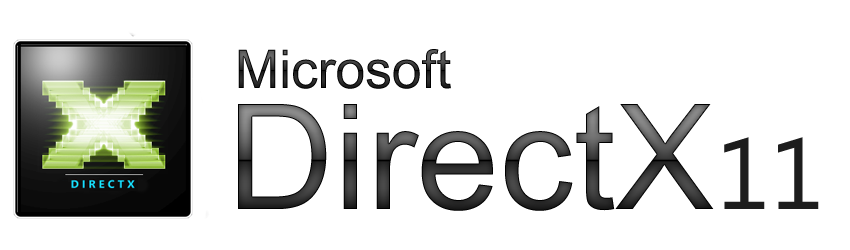

<h1 align="center">Justin Tim</h1>

<h4 align="center">Software Engineer</h4>

<!--

 
   

-->

## 💼 Languages and Tools:

   
   
  
  

  
  
  
  

  
  
   
  

## &#x1f4c8; GitHub Stats

<!--
**Jct8/Jct8** is a ✨ _special_ ✨ repository because its `README.md` (this file) appears on your GitHub profile.

Here are some ideas to get you started:

- 🔭 I’m currently working on ...
- 🌱 I’m currently learning ...
- 👯 I’m looking to collaborate on ...
- 🤔 I’m looking for help with ...
- 💬 Ask me about ...
- 📫 How to reach me: ...
- 😄 Pronouns: ...
- ⚡ Fun fact: ...
-->
